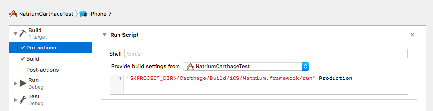

# Carthage installation

## Step 1
Add the following line to your `Cartfile`:

```
binary "https://github.com/e-sites/Natrium/raw/master/Res/Natrium.json"
```

And run `carthage update`

## Step 2

Create `.natrium.yml` in the root of your project (in the same folder as the .xcproject and .xcworkspace files).    
Check the configuration parameters [here](#configuration).


## Step 3

Create a Pre-Action per scheme which runs the following script:

```shell
"${PROJECT_DIR}/Carthage/Build/iOS/Natrium.framework/run" Production
```

The final argument `"Production"` is the actual environment you want to use for that specific scheme.<br>
This way you can create different schemes per environment



⚠️ **Warning:** Don't forget to select your target in the `Provide build settings from...` selectbox

## Step 4
Build your project (`⌘ + B` or `⌘ + R`).    
Then open the `.natrium` directory from your project root and:

- Add the `Config.swift` file to your project AND target(s).
- Add all the `Natrium.*.xcconfig` files to your project and do NOT add them to your target(s).

## Step 5
*This step can be skipped if you're not using the `xcconfig` keys in the `.natrium.yml` file*

Select the xcconfig files you just added to your project in step 4 in your project settings:


## Step 6
_This step is optional_

Add the `.natrium` directory to your `gitignore` file.     
Since the entire contents of that directory will be generated once you run natrium.