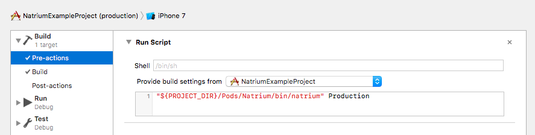

A pre-build ruby script to alter your Xcode project at build time per environment and build configuration. (swift only)

[](http://forthebadge.com) [](http://forthebadge.com)

[](http://cocoadocs.org/docsets/Natrium) [](http://cocoadocs.org/docsets/Natrium) [](https://cocoapods.org/pods/Natrium/quality)

# Roadmap
- [x] Swift 4.0 compatible
- [x] Use swift instead of ruby
- [ ] Better error handling / reporting

# Installation

## CocoaPods

### Step 1

Add the following to your `Podfile`:

```ruby
pod 'Natrium'
```

Run `pod install` or `pod update`

### Step 2

Create `.natrium.yml` in the root of your project (in the same folder as the .xcproject and .xcworkspace files).<br>
Check the configuration parameters [here](#configuration).

### Step 3

Create a Pre-Action per scheme which runs the following script:

```shell
"${PROJECT_DIR}/Pods/Natrium/bin/natrium" Production
```

The final argument `"Production"` is the actual environment you want to use for that specific scheme.<br>
This way you can create different schemes per environment



⚠️ **Warning:** Don't forget to select your target in the `Provide build settings from...` selectbox

### Step 4

Add it to your project

```swift
// AppDelegate.swift

import Natrium
let Config = Natrium.Config.self
```

This step is optional, but this way you can use the `Config` class through your entire project without having to use the `import Natrium` statement in every class.

# Configuration

## .natrium.yml

### Example

```yaml
---
environments:
  - Staging
  - Production

natrium_variables:
   DeeplinkUrlSchemeName:
     Staging: "natriumexample_staging"    
     Production: "natriumexample"    

xcconfig:
    PRODUCT_BUNDLE_IDENTIFIER:
        Staging: com.esites.app.staging
        Production:
            Adhoc,Debug: com.esites.app.production
            Release: com.esites.app
    DEEPLINK_URL_SCHEME: "#{DeeplinkUrlSchemeName}"

variables:
    testVariableDouble:
        Staging: 1.1
        Production: 5.5
    testVariableString:
        Staging,Production:
            Debug: "debugString"
            Adhoc: "adhocString"
            Release: "releaseString"
    testVariableBoolean: false
    testVariableInteger: 125
    deeplinkUrlSchemeName: "#{DeeplinkUrlSchemeName}"

plists:
    "NatriumExampleProject/Info.plist":
        CFBundleDisplayName:
            Staging: App_staging
            Production: App
    "NatriumExampleProject/App.entitlements":
        "aps-environment":
            "*":
                Debug: "development"
                Release: "production"

files:
    Firebase/GoogleService-Info.plist:
        Dev: Firebase/GoogleService-Info_DEV.plist
        Staging: Firebase/GoogleService-Info_STAGING.plist
        Production: Firebase/GoogleService-Info_PRODUCTION.plist

target_specific:
    NatriumExampleProject2:
      variables:
          testVariableString: "Target #2"
      infoplist:
        CFBundleDisplayName: "App #2"
        
appicon:
    original: icon.png
    appiconset: NatriumExampleProject/Assets.xcassets/AppIcon.appiconset/
    idioms: 
        - ipad
        - iphone
    ribbon:
        Production: ""
        Staging: "STAGING"

launch_screen_versioning:
    path: NatriumExampleProject/Base.lproj/LaunchScreen.storyboard
    labelName: LaunchScreenVersionLabel
    enabled:
        Staging: true
        Production: false
```

Key               | Type                            | Description
----------------- | ------------------------------- | --------------------------------------------------------------------------------------------------------------------------------------------------------------------------------------------------------------------------------------------------------------------------
environments      | Array                           | Which environments does your project support
natrium_variables | Dictionary*                     | Use variables within the yml file. In this build config file `#{value_name}` will be replaced with the corresponding value.
xcconfig          | Dictionary*                     | Build settings per environment / configuration
variables         | Dictionary*                     | Custom variables per environment / configuration (written in Config.swift)
plists         | Dictionary<sup><u>1</u></sup>*                     | Individual plist file locations with corresponding environment / configuration values.
files             | Dictionary<sup><u>2</u></sup>*                     | Overwrite a specific file per environment / configuration. Relative to path the project directory.
target_specific   | Dictionary<sup><u>3</u></sup>*                  | Target specific values. The first key of this dictionary is the target name, the value of that dictionary is the same as the values shown above (`infoplist`, `xcconfig`, `variables`, `files`, `appicon`). This way you can make target specific modifications per build.
appicon           | [App-icon](#App-icon)           | Place a ribbon on your app-icon
launch\_screen\_versioning              | [Launch screen versioning](#launch-screen-versioning) | Launch screen settings

- [See the Xcode Build Settings Reference](https://pewpewthespells.com/blog/buildsettings.html)
- [Checkout the platform specific Property list keys](https://developer.apple.com/library/mac/documentation/General/Reference/InfoPlistKeyReference/Articles/AboutInformationPropertyListFiles.html#//apple_ref/doc/uid/TP40009254-SW1)
- [Use the online YAML validator to validate your .natrium.yml](http://www.yamllint.com/)

**Dictionary<sup><u>1</u></sup>***:    
The `plists` dictionary's first key is the filepath, the value should be of a `Dictionary*` type.

**Dictionary<sup><u>2</u></sup>***:    
The `files` dictionary's first key is the filepath, the value should be of a `Dictionary*` type.

**Dictionary<sup><u>3</u></sup>***:    
The `target_specific ` dictionary's first key is the target name, the value should be of a `Dictionary*` type.

`Dictionary*` = All the dictionaries support different types of notations:

- **Every environment / configuration will use that `value`:**

  ```yaml
  key: value
  ```

- **Differrent values per environment**

  ```yaml
  key:
      Staging: value1
      Production: value2
  ```

- **Differrent values per environment and configuration**

  ```yaml
  key:
      Staging:
          Debug: stagingDebugValue
          Release: stagingReleaseValue    
      Production:
          Debug: productionDebugValue
          Release: productionReleaseValue
  ```

- **Differrent values per configuration**

  ```yaml
  key:
      Staging,Production:
          Debug: debugValue
          Release: releaseValue

  # or use an asterisk (*) to define all the environments: 
  
  key:
      "*":
          Debug: debugValue
          Release: releaseValue
  ```
## App icon

⚠️ **Warning**: Using this requires [ImageMagick](http://cactuslab.com/imagemagick/) to be installed on your machine.

The `app-icon` setting has 4 options:

- `original`: The relative path (according to your project) of the original icon file (preferably a size of 1024x1024). Which can be used to place the ribbon on top of it.
- `appiconset`: The relative path (according to your project) of the `AppIcon.appiconset` folder, to store the icons in
- `ribbon`: The text that should be placed in the ribbon. An empty string (`""`) would remove the ribbon
- `idioms`: What idioms should be used. Array (`ipad`, `iphone`, `watch`, `car` or `mac`)

This script searches for images in the `appiconset` directory and then puts a badge on every single one of them. So to make sure this works, the `appiconset` should contain images (pngs)

## Launch screen versioning

Alter a `UILabel` in the LaunchScreen storyboard to show the current app version.

Arguments:

Key       | Type      | Description
--------- | --------- | ---------------------------------------------------------------
path      | String *  | Relative path to the LaunchScreen.storyboard file
labelName | String *  | The accessability label value of the UILabel in that storyboard
enabled   | Boolean * | Disabling this will empty the UILabel


# Usage

The example `.natrium.yml` as shown above, will result in the following Config.swift file:

```swift
import Foundation

public class Config {
    public enum EnvironmentType: String {
        case staging = "Staging"
        case production = "Production"
    }

    public enum ConfigurationType: String {
        case debug = "Debug"
        case release = "Release"
    }

    public static let environment: EnvironmentType = .staging
    public static let configuration: ConfigurationType = .debug

    public static let testVariableDouble: Double = 1.0
    public static let testVariableString: String = "debugString"
    public static let testVariableBoolean: Bool = false
    public static let testVariableInteger: Int = 125
}
```

It can be used like so:

```swift
class MainViewController: UIViewController {
    override func viewDidLoad() {
        super.viewDidLoad()

        print("bundle identifier: \(Bundle.main.bundleIdentifier!)")
        print("environment: \(Config.environment)")
    }
}
```

**Result:**

```
bundle identifier: com.esites.app.staging
environment: staging
```
