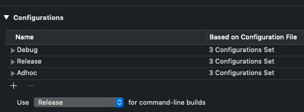

Natrium is part of the **[E-sites iOS Suite](https://github.com/e-sites/iOS-Suite)**.

---

A pre-build (Swift) script to alter your Xcode project at build-time per environment and build configuration.

[](http://forthebadge.com) [](http://forthebadge.com)

[](https://cocoapods.org/pods/Natrium)
[](https://cocoapods.org/pods/Natrium)
[](https://github.com/Carthage/Carthage)
[](https://travis-ci.org/e-sites/Natrium)

# TL;DR

With Natrium you can change this:

```swift
#if ENVIRONMENT_STAGING
    let apiHost = "mynice.staging-api.com"
    
#elseif ENVIRONMENT_DEVELOPMENT
    let apiHost = "mynice.dev-api.com"
    
#else
    let apiHost = "mynice.api.com"
#endif

Alamofire.request("https://\(apiHost)/items").responseJSON { response in
    // ...
}
```


Into this:

```swift
let apiHost = Natrium.Config.apiHost

Alamofire.request("https://\(apiHost)/items").responseJSON { response in
    // ...
}
```


### 🧙‍♂️ With the magic of pre-action run scripts. 😱

# Notices

> ⚠️ **IMPORTANT**  
> For Natrium v6.x you need to manually import the `Natrium.swift` file to your project to make it work in the new xcode build system. Read the [Installation](#installation) guide.
>
> Natrium v5.x doesn't need a build phase script anymore.    
> Open your `Build Phases` from your target settings and remove the `[Natrium] check` step.    
>     
> Else your build will fail during the script steps

# Roadmap
- [x] Swift 4.0 compatible
- [x] Use swift instead of ruby
- [x] Remove ImageMagick dependency
- [x] Unit tests
- [x] Different installation options (apart from CocoaPods)
- [x] Better error handling / reporting

# Installation

- CocoaPods → [Read the instructions here](docs/INSTALL_COCOAPODS.md).
- Carthage → [Read the instructions here](docs/INSTALL_CARTHAGE.md).
- Manually → [Read the instructions here](docs/INSTALL_MANUALLY.md).

# Implementation

## Swift
Just add `Natrium.swift` (from the designated location, see installation guide) to your project's target (do not copy).

## Objective-c
Just add `NatriumConfig.h` and `NatriumConfig.m` to your project's target (do not copy)

# Configuration

Configuration documentation can be found [here](docs/CONFIGURATION.md).

# Usage

The example `.natrium.yml` as shown above, will result in the following Config.swift file:

```swift
import Foundation

/// Natrium.swift
/// Autogenerated by natrium
///
/// - see: https://github.com/e-sites/Natrium

class Natrium {

    enum Environment: String {
        case staging = "Staging"
        case production = "Production"
    }

    enum Configuration: String {
        case debug = "Debug"
        case release = "Release"
        case adhoc = "Adhoc"
    }

    class Config {
        static let environment: Natrium.Environment = .staging
        static let configuration: Natrium.Configuration = .debug
        static let testVariableDouble: Double = 1.0
        static let testVariableString: String = "debugString"
        static let testVariableBoolean: Bool = false
        static let testVariableInteger: Int = 125
    }
}
```

It can be used like so:

```swift
class MainViewController: UIViewController {
    override func viewDidLoad() {
        super.viewDidLoad()

        print("bundle identifier: \(Bundle.main.bundleIdentifier!)")
        print("environment: \(Natrium.Config.environment)")
    }
}
```

**Result:**

```
bundle identifier: com.esites.app.staging
environment: Staging
```

# Development

Run
 
```
swift package generate-xcodeproj
```

and open `Natrium.xcodeproj`


# Advanced

## Re-install

To re-run the previous natrium command with the stored arguments from the Natrium.lock file:

```
./natrium install
```


## Logging

In the `Pods/Natrium/bin/` folder you can find `natrium.log` with the logs of the previous build. It might help you with debugging.