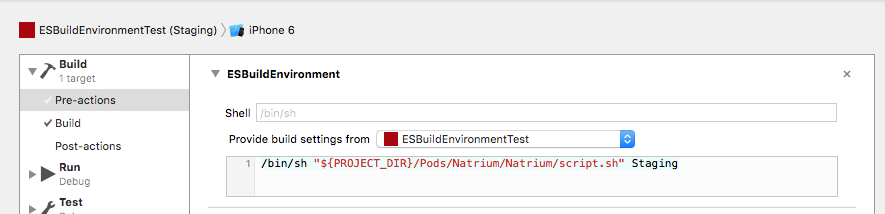

A pre-build ruby script to alter your Xcode project at build time per environment and build configuration.
(swift only)

[](http://cocoadocs.org/docsets/Natrium)
[](http://cocoadocs.org/docsets/Natrium)
[](https://cocoapods.org/pods/Natrium/quality)

## Installation

### CocoaPods

#### Step 1
Add the following to your `Podfile`:

```ruby
pod 'Natrium'
```
Run `pod install` or `pod update`

#### Step 2
Create `build-config.yml` in the root of your project (in the same folder as the .xcproject and .xcworkspace files).<br>
Check the configuration parameters [here](#configuration).

#### Step 3
Create a Pre-Action per scheme which runs the following script:

```shell
/bin/sh "${PROJECT_DIR}/Pods/Natrium/Natrium/script.sh" Staging
```
The final argument `"Staging"` is the actual environment you want to use for that specific scheme.<br>
This way you can create different schemes per environment



⚠️ **Warning:** Don't forget to select your target in the `Provide build settings from...` selectbox

#### Step 4 (Optional)

Add a `Run Script` Build Phase for your target(s):

```shell
/bin/sh "${PROJECT_DIR}/Pods/Natrium/Natrium/checkbuild.sh"
```

This step is optional, but can be useful to see if any errors occured during the run of the pre-action script. 
Since the pre-action script cannot throw build errors, this build phase run script is here to catch those potential errors and show them in your build log.

#### Step 5 (Optional)

Add it to your project

```swift
// AppDelegate.swift

import Natrium
let Config = Natrium.Config
```

This step is also optional, but this way you can use the `Config` class through your entire project without having to use the `import Natrium` statement in every class.

##Configuration

###build-config.yml

####Example

```yaml
environments:
  - Staging
  - Production
      
natrium_variables:
   DeeplinkUrlSchemeName: 
	   	Staging: "natriumexample_staging"    
	   	Production: "natriumexample"    

infoplist:
    CFBundleDisplayName:
        Staging: App_staging
        Production: App

xcconfig:
    PRODUCT_BUNDLE_IDENTIFIER:
        Staging: com.esites.app.staging
        Production:
            Adhoc,Debug: com.esites.app.production
            Release: com.esites.app
            
    DEEPLINK_URL_SCHEME: "#{DeeplinkUrlSchemeName}"

variables:
    testVariableDouble:
        Staging: 1.1
        Production: 5.5

    testVariableString:
        Staging,Production:
            Debug: "debugString"
            Adhoc: "adhocString"
            Release: "releaseString"
    testVariableBoolean: false
    testVariableInteger: 125
    deeplinkUrlSchemeName: "#{DeeplinkUrlSchemeName}"
    
files:
    Firebase/GoogleService-Info.plist:
        Dev: Firebase/GoogleService-Info_DEV.plist
        Staging: Firebase/GoogleService-Info_STAGING.plist
        Production: Firebase/GoogleService-Info_PRODUCTION.plist
        
appicon:
    original: icon.png
    appiconset: NatriumExampleProject/Assets.xcassets/AppIcon.appiconset/
    ribbon:
        Production: ""
        Staging: "STAGING"

target_specific:
    NatriumExampleProject2:
      variables:
          testVariableString: "Target #2"
      infoplist:
        CFBundleDisplayName: "App #2"
     
	
```

Key          | Type        | Description
------------ | ----------- | --------
environments | Array       | Which environments does your project support
natrium_variables | Dictionary* | Use variables within the yml file. In this build config file "`#{value_name}`" will be replaced with the corresponding value.
infoplist    | Dictionary* | Keys of the Info.plist to be changed per environment / configuration. Instead of the `infoplist` directive, you can also use a relative path to the .plist file location.
xcconfig     | Dictionary* | Build settings per environment / configuration
variables    | Dictionary* | Custom variables per environment / configuration (written in Config.swift) 
files		   | Dictionary* | Overwrite a specific file per environment / configuration. Relative to path the project directory.
appicon		| [App-Icon](#app-icon)  | Place a ribbon on your app-icon
target_specific | Dictionary | Target specific values. The first key of this dictionary is the target name, the value of that dictionary is the same as the values shown above (`infoplist`, `xcconfig`, `variables`, `files`, `appicon`). This way you can make target specific modifications per build.

* [See the Xcode Build Settings Reference](https://pewpewthespells.com/blog/buildsettings.html)
* [Checkout the platform specific Property list keys](https://developer.apple.com/library/mac/documentation/General/Reference/InfoPlistKeyReference/Articles/AboutInformationPropertyListFiles.html#//apple_ref/doc/uid/TP40009254-SW1)
* [Use the online YAML validator to validate your build-config.yml](http://www.yamllint.com/)

\* All the dictionaries support different types of notations:

- **Every environment / configuration will use that `value`:**

  ```yaml
  key: value
  ```  
  
- **Differrent values per environment**

  ```yaml
  key: 
	    Staging: value1
	    Production: value2
  ```
  
- **Differrent values per environment and configuration**

  ```yaml
  key: 
	    Staging: 
	    	    Debug: stagingDebugValue
	    	    Release: stagingReleaseValue    
	    Production:
	    	    Debug: productionDebugValue
	    	    Release: productionReleaseValue
  ```
  
- **Differrent values per configuration**

  ```yaml
  key: 
	    Staging,Production: 
	    	    Debug: debugValue
	    	    Release: releaseValue    
  ```
  
### App-Icon

⚠️ **Warning**:
Using this requires [ImageMagick](http://cactuslab.com/imagemagick/) to be installed on your machine.
  
The `app-icon` setting has 3 options:
  
- `original`: The relative path (according to your project) of the original icon file (minimum of 180x180px). Which can be used to put the ribbon on  
- `appiconset`: The relative path (according to your project) of the `AppIcon.appiconset` folder, to store the icons in
- `ribbon`: The text that should be placed in the ribbon. An empty string (`""`) would remove the ribbon
- `legacy`: Set this value to `true` if you're using an older version then Xcode 8 (default = `false`)

This script searches for images in the `appiconset` directory and then puts a badge on every single one of them. So to make sure this works, the `appiconset` should contain images (pngs)

  
## Usage
  
The example `build-config.yml` as shown above, will result in the following Config.swift file:
  
```swift
import Foundation

public class Config {
	public enum EnvironmentType {
	    case Staging
	    case Production
	}
	
	public static let environment:EnvironmentType = .Staging
	
	public static let testVariableDouble:Double = 1.1
	public static let testVariableString:String = "debugString"
	public static let testVariableBoolean:Bool = false
	public static let testVariableInteger:Int = 125
	public static let deeplinkUrlSchemeName:String = "natriumexample_staging"
}
```

It can be used like so:

```swift
class ViewController: UIViewController {
	override func viewDidLoad() {
		super.viewDidLoad()
		
		print("bundle identifier: \(NSBundle.mainBundle().bundleIdentifier)")
		print("environment: \(Config.environment)")
	}
}
```

**Result:**

```
bundle identifier: Optional("com.esites.app.staging")
environment: Staging
```
