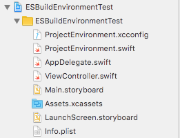
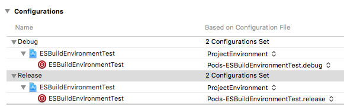

An advanced pre-build ruby script to alter your project per environment and build configuration.
(swift only)

## Installation

### CocoaPods

#### Step 1
Add the following to your `Podfile`:

```ruby
pod Natrium
```
run `pod install` or `pod update`

#### Step 2
Create `build-config.yml` in the root of your project (next to the .xcproject and .xcworkspace files).<br>
For configuration parameters check **here**

#### Step 3 
Open the `./Pods/Natrium/Natrium/` folder in your finder and 
add `ProjectEnvironment.swift` and `ProjectEnvironment.xcconfig` to your xcode project:



*Make sure `ProjectEnvironment.swift` is also linked to your target(s)*<br>
*IMPORTANT: Uncheck "Copy files if needed" when adding them to your project*

#### Step 4
Link `ProjectEnvironment.xcconfig` to your active configurations



#### Step 5
Create a Pre-Action per scheme which runs the following script:

```shell
/bin/sh "${PROJECT_DIR}/Pods/Natrium/Natrium/script.sh" Staging
```
The final argument `"Staging"` is the actual environment you want to use for that specific scheme.<br>
This way you can create different schemes per environment


#### Step 6

Add a `Run Script` Build Phase for your target(s):

```shell
/bin/sh "${PROJECT_DIR}/Pods/Natrium/Natrium/checkbuild.sh"
```

This final step is optional, but can be useful to see if any errors occured during the run of the pre-action script. 
Since the pre-action script cannot throw build errors, this build phase run script is here to catch those potential errors and show them in your build log.

## Configuration

### build-config.yml

#### Example

```yaml
baseClass: Config

environments:
  - Staging
  - Production

infoplist:
    CFBundleDisplayName:
        Staging: App_staging
        Production: App

    CFBundleIdentifier:
        Staging: com.esites.app.staging
        Production:
            Adhoc,Debug: com.esites.app.production
            Release: com.esites.app

xcconfig:
    ASSETCATALOG_COMPILER_APPICON_NAME:
        Staging: AppIcon1
        Production: AppIcon2

variables:
    testVariableDouble:
        Staging: 1.1
        Production: 5.5

    testVariableString:
        Staging,Production:
            Debug: "debugString"
            Adhoc: "adhocString"
            Release: "releaseString"
    testVariableBoolean: false
    testVariableInteger: 125
```

Key          | Type        | Description
------------ | ----------- | --------
baseClass    | String      | The class name the Config class should be called (optional, default = "Config")
environments | Array       | Which environments does your project support
infoplist    | Dictionary* | Keys of the Info.plist to be changed per environment / configuration
xcconfig     | Dictionary* | Build settings per environment / configuration
variables    | Dictionary* | Custom variables per environment / configuration (written in ProjectEnvironment.swift) 

* [See the Xcode Build Settings Reference](https://pewpewthespells.com/blog/buildsettings.html)
* [Checkout the platform specific Property list keys](https://developer.apple.com/library/mac/documentation/General/Reference/InfoPlistKeyReference/Articles/AboutInformationPropertyListFiles.html#//apple_ref/doc/uid/TP40009254-SW1)

\* All the dictionaries support different types of notations:

- **Every environment / configuration will use that `value`:**

  ```yaml
  key: value
  ```  
  
- **Differrent values per environment**

  ```yaml
  key: 
	    Staging: value1
	    Production: value2
  ```
  
- **Differrent values per environment and configuration**

  ```yaml
  key: 
	    Staging: 
	    	    Debug: stagingDebugValue
	    	    Release: stagingReleaseValue    
	    Production:
	    	    Debug: productionDebugValue
	    	    Release: productionReleaseValue
  ```
  
- **Differrent values per configuration**

  ```yaml
  key: 
	    Staging,Production: 
	    	    Debug: debugValue
	    	    Release: releaseValue    
  ```
  
  
## Usage
  
The example `build-config.yml` as shown above, will result in the following ProjectEnvironment.swift file:
  
```swift
import Foundation

public class Config {
	public enum EnvironmentType {
	    case Staging
	    case Production
	}
	
	public static let environment:EnvironmentType = .Staging
	
	public static let testVariableDouble:Double = 1.1
	public static let testVariableString:String = "debugString"
	public static let testVariableBoolean:Bool = false
	public static let testVariableInteger:Int = 125
}
```

It can be used like so:

```swift
 func application(application: UIApplication, didFinishLaunchingWithOptions launchOptions: [NSObject: AnyObject]?) -> Bool {
    print("bundle identifier: \(NSBundle.mainBundle().bundleIdentifier)")
    print("environment: \(Config.environment)")
    return true
}
```

**Result:**

```
bundle identifier: Optional("com.esites.app.staging")
environment: Staging
```